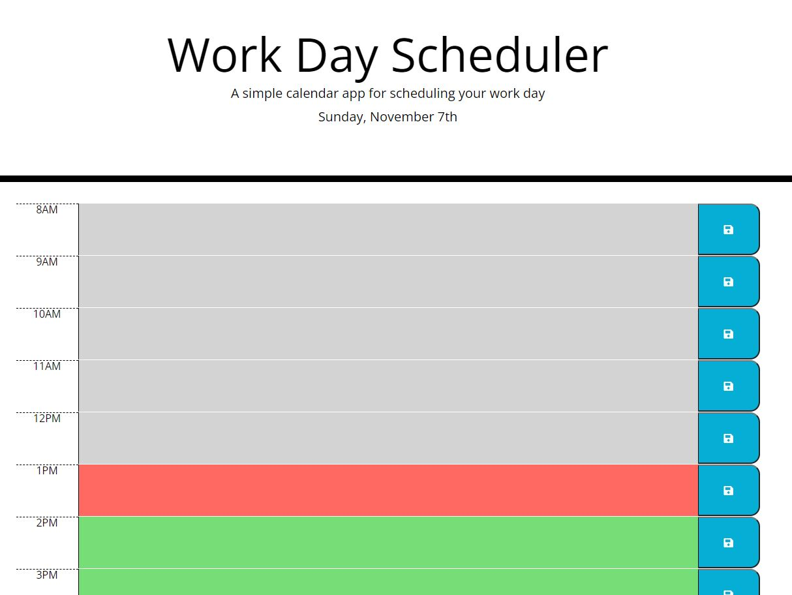

# Work Day Scheduler
A simple calendar application that allows a user to save events for each hour of the day.

## User Story
AS AN employee with a busy schedule
I WANT to add important events to a daily planner
SO THAT I can manage my time effectively

## Acceptance Criteria
* The current day is displayed at the top of the calendar when the user opens the planner
* The user is presented with time blocks for standard business hours when the user scrolls down
* Each time block is color-coded to indicate whether it is in the past, present, or future
* The user can enter an event in a time block on click
* The text for that event is saved in local storage on click of the save button
* The saved events persist on page refresh

## Assets
The following image demonstrates the web application's appearance and functionality:

